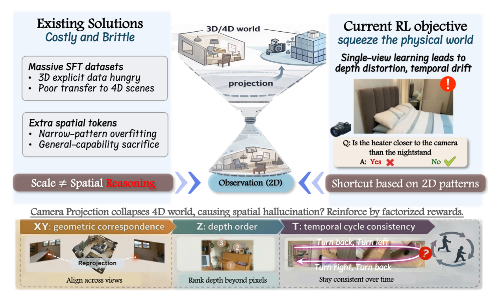
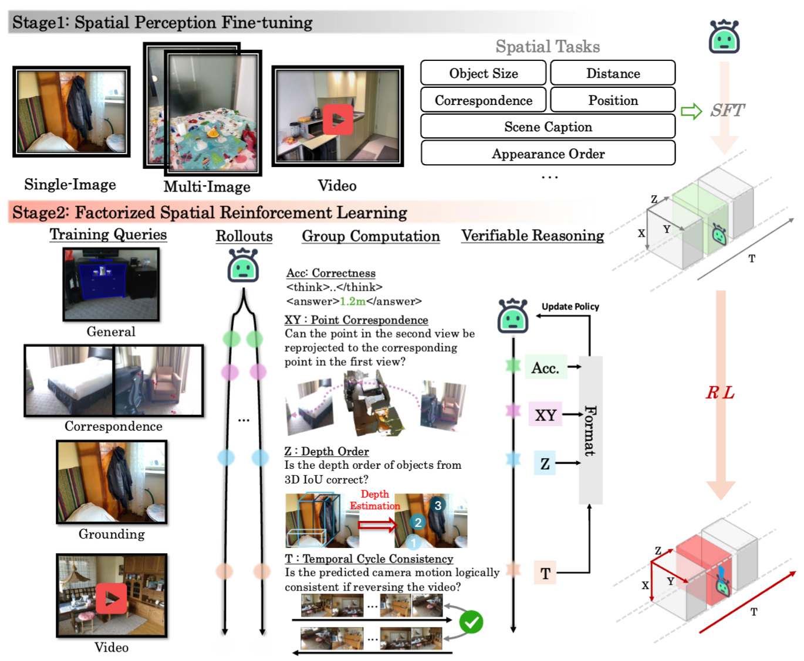

# [ECCV 2026] Unfold The World: Factorize 4D Properties in Reinforcing Spatial Reasoning

<div align="center">
  <a href="https://arxiv.org/abs/2609.03729"></a>
  <a href="LICENSE"></a>

  
</div>

This repository contains the code for **FactoSR**, a framework for training Vision-Language Models (VLMs) on spatial reasoning tasks using factorized reward functions and reinforcement learning.

## Overview



**Motivation.** Current VLMs remain fundamentally "flat" when reasoning about the physical world: they are trained on 2D projections, yet real-world perception is inherently multi-view, depth-aware, and temporally continuous. Simply scaling SFT or adding spatial tokens fails to yield a coherent latent world model, while directly optimizing a monolithic 4D objective over space and time is computationally and algorithmically intractable. FactoSR addresses this by decomposing spatial reasoning into independent, verifiable sub-tasks and training VLMs with factorized reward signals:

- **Spatial XY** (`spatial_xy`): planar correspondence — point matching across multi-view images via geometric reprojection
- **Spatial Z** (`spatial_z`): depth consistency — 3D spatial grounding with 3D IoU, projection, and depth ordering
- **Spatial T** (`spatial_t`): temporal reversibility — camera-motion cycle consistency via inverse questioning

## Framework



**FactoSR pipeline.** We adopt a "divide and conquer" paradigm that recovers the dimensions collapsed by camera projection. The training pipeline cascades two stages:

1. **Stage 1 — FactoSR-SFT**: Supervised fine-tuning (short-answer + CoT cold-start) injects initial spatial perception into the VLM.
2. **Stage 2 — FactoSR-RL**: DAPO-based reinforcement learning with a multi-objective reward framework — *format* rewards enforce structured outputs, *accuracy* rewards prioritize correctness, and the three factorized rewards (**XY**, **Z**, **T**) constrain reprojection consistency across views, precise 3D localization / depth ordering, and reversible camera-motion reasoning respectively.

Together, these factorized rewards guide the model through an *observe → localize → think → answer* process, transforming ill-posed projection recovery into a series of tangible reasoning steps. Built on top of the [verl](https://github.com/volcengine/verl) framework, FactoSR achieves **+5.9% on VSI-Bench** and **+4.5% on All-Angles-Bench**, while preserving general multimodal capabilities.

## Installation

```bash
pip install -e .
# Or install dependencies manually:
pip install -r requirements.txt
```


## Data Format

Training data uses **TAR WebDataset** format, loaded via `verl.utils.dataset.rl_tar_dataset.RLTarDataset`.

Each sample contains:
- `prompt`: The conversation/question (with image placeholders)
- `images`: List of image paths or PIL images
- `ground_truth`: Answer string or dict
- `data_source`: Reward routing key (e.g., `"accuracy+format+spatial_xy"`)
- Task-specific fields: `depth1`, `depth2`, `K1`, `K2`, `pose1`, `pose2`, `candidate_points`, `correspondence_points`, etc.

## Training

### Stage 1: Supervised Fine-Tuning

**Short-answer SFT** (direct answer training):
```bash
bash run_exp/train_sft.sh
```

**CoT cold-start SFT** (chain-of-thought training):
```bash
bash run_exp/train_cot.sh
```

### Stage 2: RL Training (DAPO + Factorized Rewards)

```bash
bash recipe/verl_dapo_tar.sh
```

This launches DAPO training with:
- GRPO advantage estimator
- Factorized reward: `format (gate) * (w_accuracy * accuracy + w_xy * spatial_xy + w_t * spatial_t)`
- Token-mean loss aggregation
- Multi-dataset sampling with configurable ratios
- vLLM rollout with tensor parallelism


## Project Structure

```
FactoSR/
├── verl/                          # verl framework (mostly untouched)
│   ├── trainer/                   # Training infrastructure
│   │   ├── ppo/
│   │   │   └── ray_trainer_for_tar.py   # TAR-aware Ray trainer
│   │   └── config/
│   │       └── algorithm.py             # Algorithm config (DAPO/GRPO)
│   └── utils/
│       ├── reward_score/          # *** FactoSR reward functions ***
│       │   ├── spatial_reward.py  # Unified spatial reward entry point
│       │   ├── spatial_xy.py      # XY reprojection reward
│       │   ├── spatial_z.py       # 3D spatial grounding reward
│       │   ├── spatial_t.py       # Temporal consistency reward
│       │   ├── combined_reward.py # Multi-reward combination
│       │   └── __init__.py        # Reward routing
│       └── dataset/
│           ├── rl_tar_dataset.py  # RL TAR WebDataset loader
│           └── tar_dataset.py     # Base TAR dataset
├── recipe/
│   ├── dapo/                      # DAPO recipe
│   │   ├── main_dapo.py           # DAPO entry point
│   │   ├── dapo_ray_trainer_for_tar.py  # TAR-aware DAPO trainer
│   │   └── config/
│   │       └── dapo_trainer.yaml  # DAPO training config
│   └── verl_dapo_tar.sh    # *** Main RL training script ***
├── run_exp/
│   ├── train_sft.sh               # Stage 1: Short-answer SFT
│   └── train_cot.sh           # Stage 1: CoT cold-start SFT
└── README.md
```

## License

Apache License 2.0. See [LICENSE](LICENSE) for details.


## Acknowledgement

This project is built upon several excellent open-source works. We sincerely thank the authors and communities for making them available: [VeRL](https://github.com/volcengine/verl), [DAPO](https://github.com/BytedTsinghua-SIA/DAPO), [vLLM](https://github.com/vllm-project/vllm), [Qwen3-VL](https://github.com/QwenLM/Qwen3-VL), [VLMEvalKit](https://github.com/open-compass/VLMEvalKit).

## Citation
If you find it help, please cite and star this project. 😊

```
@article{yang2026unfold,
  title={Unfold The World: Factorize 4D Properties in Reinforcing Spatial Reasoning},
  author={Yang, Yijun and Zheng, Shenghe and Li, Wenbo and Liu, Jianhui and Sun, Haoze and Zhang, Yanbing and Jiang, Jiaxiu and Song, Lin and Huang, Haoyang and Duan, Nan and others},
  journal={arXiv preprint arXiv:2609.03729},
  year={2026}
}
```

